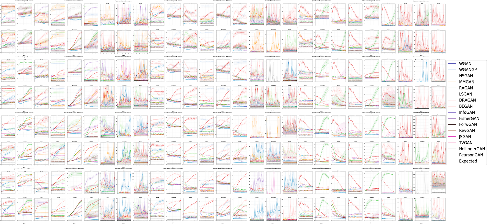

# Introduction
Code for reproducing results from	S. O’Brien, M. Groh and A. Dubey. “Evaluating Generative Adversarial Networks on Explicitly Parameterized Distributions”. Presented at *Neural Information Processing Systems (NeurIPS) Workshop on Critiquing and Correcting Trends in Machine Learning*, 2018.



# Abstract
The true distribution parameterizations of commonly used image datasets are inaccessible. Rather than designing metrics for feature spaces with unknown parameterizations, we propose to measure GAN performance by evaluating on explicitly parameterized, synthetic data distributions. As a case study, we examine the performance of 16 GAN variants on six multivariate distributions of varying dimensionalities and training set sizes. In this learning environment, we observe that: GANs exhibit similar performance trends across dimensionalities; learning depends on the underlying distribution and its complexity;  the number of training samples can have a large impact on performance; evaluation and relative comparisons are metric-dependent; diverse sets of hyperparameters can produce a "best" result; and some GANs are more robust to hyperparameter changes than others. These observations both corroborate findings of previous GAN evaluation studies and make novel contributions regarding the relationship between size, complexity, and GAN performance.

# Download results
Our best results data (41.8 MB) can be downloaded via MIT Dropbox [here](https://www.dropbox.com/sh/4jd6ixsw64xs2jf/AACnSoKyrmfKlfMe140J-ezpa?dl=0). The full dataset of all hyperparameter settings (51.6 GB) is available upon request (email shayneob@mit.edu).

# Initialization
```
git clone https://github.com/shayneobrien/explicit-gan-eval  
cd explicit-gan-eval
python3 -m venv env  
. env/bin/activate
pip install -r requirements.txt  
```

# Reproduce figures
See the following [notebook](https://github.com/shayneobrien/explicit-gan-eval/blob/master/notebooks/viz-multivariate.ipynb) for code to run visualizations. Be sure to move the downloaded data into your local repository, or it will not run.

# Running code
**Run a single job** (e.g. run on GPU 3 one trial of multivariate for 32 dimensional data, 25 epochs, and 1000 samples)
```
CUDA_VISIBLE_DEVICES=3 python3 main.py multivariate 1 32 25 1000
```

**Run a batch of jobs** (e.g. 5 jobs named 1 through 5 on GPU 0 using dataset multivariate, 2 trials per job, 32 dimensions, and 10000 samples.)
```
bash job.sh 1 5 0 multivariate 2 32 10000
```

**Parallelize batch of jobs across multiple GPUs on the same machine** (e.g. run 3 trials of multivariate for 128 dimensional data, 25 epochs, 100000 samples. From GPU 3 onward (in case machine is shared), spread these jobs across all other GPUs on the machine at a rate of 16 jobs per GPU)
```
python3 parallel_jobs.py multivariate 3 128 25 100000 3 16
```

**Run all jobs** (this would take several years to finish on a single GPU)
```
CUDA_VISIBLE_DEVICES=0 python3 run.py
```

# Reproduce figures
See [notebook](https://github.com/shayneobrien/explicit-gan-eval/blob/master/notebooks/viz-multivariate.ipynb).
```
from src.utils import *

%matplotlib inline

# Empirical 'Expected'
expected = get_empirical_divergences()

# Reproduce subplots from Figures 1, 2, and 3
graph_multivariate(expected=expected, ci=True, omit_outliers=True, thresh=2.5, save=False)

# Reproduce data for Table 2 that was presented in Tables 3, 4, and 5
param_dict = print_confidence_intervals()

# Reproduce subplots from Figures 4, 5, and 6
graph_fncsamples(param_dict, expected=expected, save=False)

# Reproduce data used for Table 6
print_best_hyperparameters()

# Reproduce data from Table 7
robust = hyperparameter_robustness()

# Reproduce data from Table 8
get_trainable_param_counts()
```

# Running code
**Run a single job** (e.g. run on GPU 3 one trial of multivariate for 32 dimensional data, 25 epochs, and 1000 samples)
```
CUDA_VISIBLE_DEVICES=3 python3 main.py multivariate 1 32 25 1000
```

**Run a batch of jobs** (e.g. 5 jobs named 1 through 5 on GPU 0 using dataset multivariate, 2 trials per job, 32 dimensions, and 10000 samples.)
```
bash job.sh 1 5 0 multivariate 2 32 10000
```

**Parallelize batch of jobs across multiple GPUs on the same machine** (e.g. run 3 trials of multivariate for 128 dimensional data, 25 epochs, 100000 samples. From GPU 3 onward (in case machine is shared), spread these jobs across all other GPUs on the machine at a rate of 16 jobs per GPU)
```
python3 parallel_jobs.py multivariate 3 128 25 100000 3 16
```

**Run all jobs** (this would take several years to finish on a single GPU)
```
CUDA_VISIBLE_DEVICES=0 python3 run.py
```
